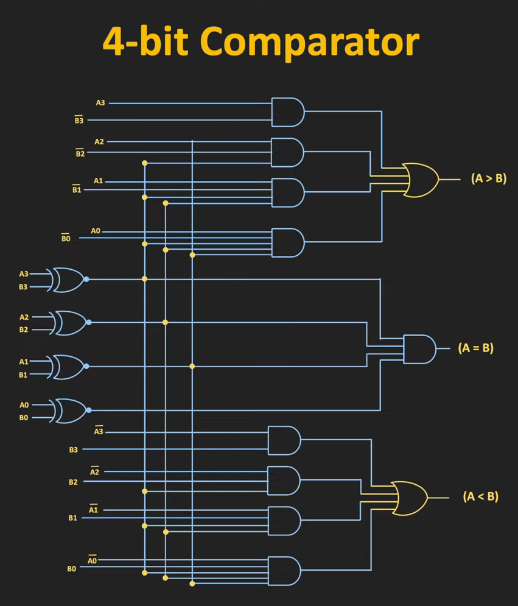

# Comparator in Digital Electronics - Complete Guide

## Table of Contents

1. [Introduction to Comparator](#1-introduction-to-comparator)
2. [What is a Comparator?](#2-what-is-a-comparator)
3. [Types of Comparators](#3-types-of-comparators)
4. [1-Bit Comparator](#4-1-bit-comparator)
5. [2-Bit Comparator](#5-2-bit-comparator)
6. [4-Bit Comparator](#6-4-bit-comparator)
7. [Internal Logic Workflow - How Comparators Actually Work](#7-internal-logic-workflow---how-comparators-actually-work)
8. [Cascading Comparators](#8-cascading-comparators)
9. [Applications of Comparators](#10-applications-of-comparators)
10. [Key Learnings - Q&A Format](#13-key-learnings---qa-format)

---

## 1. Introduction to Comparator

- A **Comparator** is a **combinational circuit** that compares two binary numbers and determines their relationship. 
- “A magnitude comparator internally behaves like a priority encoder, where the most significant unequal bit determines the output.”

### Why do we need Comparators?

In digital systems, we often need to:  

- Compare two numbers
- Determine which is greater or smaller
- Check if two numbers are equal

**Example Use Cases:**

- Sorting algorithms
- Control systems
- ALU (Arithmetic Logic Unit)
- Microprocessors
- Voting machines

---

## 2. What is a Comparator?

### Definition

> A **Digital Comparator** is a hardware electronic device that takes two numbers as input in binary form and determines whether one number is:  
> - **Greater than** the other
> - **Less than** the other
> - **Equal to** the other

### Block Diagram


### Outputs

A comparator typically has **3 outputs**:  

| Output | Condition | Symbol |
|--------|-----------|--------|
| **Greater** | A > B | G or A>B |
| **Equal** | A = B | E or A=B |
| **Less** | A < B | L or A<B |

---

## 3. Types of Comparators

### Based on Number of Bits

1. **1-Bit Comparator** - Compares two 1-bit numbers
2. **2-Bit Comparator** - Compares two 2-bit numbers
3. **4-Bit Comparator** - Compares two 4-bit numbers
4. **8-Bit Comparator** - Compares two 8-bit numbers (may use two 4-bit comparators by cascading)
5. **N-Bit Comparator** - Compares two N-bit numbers


| Comparator Type | Input Bits | Number of Combinations |
|-----------------|------------|------------------------|
| 1-Bit           | 2          | 2² = 4                 |
| 2-Bit           | 4          | 2⁴ = 16                |
| 4-Bit           | 8          | 2⁸ = 256               |
| n-Bit           | 2n         | 2^(2n)                 |

---

## 4. 1-Bit Comparator

### Description

Compares two **1-bit binary numbers**:  A and B

### Truth Table

| A | B | A > B | A = B | A < B |
|---|---|-------|-------|-------|
| 0 | 0 | 0     | 1     | 0     |
| 0 | 1 | 0     | 0     | 1     |
| 1 | 0 | 1     | 0     | 0     |
| 1 | 1 | 0     | 1     | 0     |

### Boolean Expressions

From the truth table, we can derive:  

```
A > B  =  A · B'
A = B  =  A'B' + AB  =  A ⊙ B  (XNOR)
A < B  =  A' · B
```

Where:
- `·` = AND
- `'` = NOT
- `+` = OR
- `⊙` = XNOR

### Logic Circuit Diagram


### Gate Count

- **AND gates:** 2
- **NOT gates:** 2
- **XNOR gate:** 1 (can be built using 4 gates:  2 NOT, 2 AND, 1 OR)

---

## 5. 2-Bit Comparator

### Description

Compares two **2-bit binary numbers**: 

- A = A₁A₀
- B = B₁B₀

Where:
- A₁, B₁ are MSB (Most Significant Bit)
- A₀, B₀ are LSB (Least Significant Bit)

### Logic for Comparison

#### A > B when:  

1. A₁ > B₁ (MSB of A is greater)
2. OR A₁ = B₁ AND A₀ > B₀ (MSBs equal, but LSB of A is greater)

**Boolean Expression:**

```
A > B = A₁B₁' + (A₁ ⊙ B₁)·A₀B₀'
```

Or:

```
A > B = A₁B₁' + (A₁B₁ + A₁'B₁')·A₀B₀'
```

#### A = B when: 

Both bits match:  

```
A = B = (A₁ ⊙ B₁)·(A₀ ⊙ B₀)
```

Or:  

```
A = B = (A₁B₁ + A₁'B₁')·(A₀B₀ + A₀'B₀')
```

#### A < B when:

1. A₁ < B₁ (MSB of A is smaller)
2. OR A₁ = B₁ AND A₀ < B₀ (MSBs equal, but LSB of A is smaller)

**Boolean Expression:**

```
A < B = A₁'B₁ + (A₁ ⊙ B₁)·A₀'B₀
```

### Logic Diagram - Derived from Boolean Expression


### Truth Table 


From the above truth table, K-map for each output can be drawn as follows.

### K-map of Output A>B


### K-map of Output A=B


### K-map of Output A<B


### Logic Diagram - Derived from K-map reduction

Inputs:  A₁, A₀, B₁, B₀
Outputs: A>B, A=B, A<B


### Example

Compare A = 10₂ and B = 01₂

- A₁ = 1, A₀ = 0
- B₁ = 0, B₀ = 1

Check A > B:
```
A > B = A₁B₁' + (A₁ ⊙ B₁)·A₀B₀'
      = 1·1 + 0·...  
      = 1
```

**Result:** A > B = 1 ✓ (since 10₂ = 2 > 1 = 01₂)

---

## 6. 4-Bit Comparator

### Description

Compares two **4-bit binary numbers**:

- A = A₃A₂A₁A₀
- B = B₃B₂B₁B₀

### Comparison Logic

The comparison is done **bit by bit from MSB to LSB**.  

#### A > B when:  

```
A > B = A₃B₃' 
      + (A₃ ⊙ B₃)·A₂B₂' 
      + (A₃ ⊙ B₃)·(A₂ ⊙ B₂)·A₁B₁' 
      + (A₃ ⊙ B₃)·(A₂ ⊙ B₂)·(A₁ ⊙ B₁)·A₀B₀'
```

**In words:**

1. If A₃ > B₃, then A > B
2. Else if A₃ = B₃ and A₂ > B₂, then A > B
3. Else if A₃ = B₃, A₂ = B₂, and A₁ > B₁, then A > B
4. Else if all higher bits equal and A₀ > B₀, then A > B

#### A = B when:

```
A = B = (A₃ ⊙ B₃)·(A₂ ⊙ B₂)·(A₁ ⊙ B₁)·(A₀ ⊙ B₀)
```

All bits must match.  

#### A < B when:  

```
A < B = A₃'B₃ 
      + (A₃ ⊙ B₃)·A₂'B₂ 
      + (A₃ ⊙ B₃)·(A₂ ⊙ B₂)·A₁'B₁ 
      + (A₃ ⊙ B₃)·(A₂ ⊙ B₂)·(A₁ ⊙ B₁)·A₀'B₀
```
### Logic Circuit Diagram



## 7. Internal Logic Workflow - How Comparators Actually Work

### 🔍 The Secret:  Priority-Based Comparison

> **Key Insight:** Comparators work on a **priority encoder** principle - they compare from **MSB to LSB** and stop as soon as a difference is found.

### Step-by-Step Internal Workflow

Let's understand with a **4-bit comparator** example:  A = 1011, B = 1001

```
═══════════════════════════════════════════════════════════════
                INTERNAL COMPARISON WORKFLOW
═══════════════════════════════════════════════════════════════

STEP 1: Compare MSB (Bit 3)
────────────────────────────────────────────────────────────────
    A₃ = 1, B₃ = 1
    
    Check:  A₃ > B₃?   →  1 > 1?  →  NO
    Check: A₃ < B₃?  →  1 < 1?  →  NO
    Check: A₃ = B₃?  →  1 = 1?  →  YES ✓
    
    Decision:  EQUAL at bit 3, need to check next bit
    Status: CONTINUE →

────────────────────────────────────────────────────────────────
STEP 2: Compare Bit 2 (only if Bit 3 was equal)
────────────────────────────────────────────────────────────────
    A₂ = 0, B₂ = 0
    
    Check: A₂ > B₂?  →  0 > 0?  →  NO
    Check: A₂ < B₂?  →  0 < 0?  →  NO
    Check: A₂ = B₂?  →  0 = 0?   →  YES ✓
    
    Decision: EQUAL at bit 2, need to check next bit
    Status: CONTINUE →

────────────────────────────────────────────────────────────────
STEP 3: Compare Bit 1 (only if Bit 3,2 were equal)
────────────────────────────────────────────────────────────────
    A₁ = 1, B₁ = 0
    
    Check: A₁ > B₁?  →  1 > 0?  →  YES ✓✓✓
    
    Decision: A is GREATER!  
    Status: STOP ■ (No need to check further)
    
    Final Output: 
    ┌─────────────────┐
    │  A > B = 1      │
    │  A = B = 0      │
    │  A < B = 0      │
    └─────────────────┘

────────────────────────────────────────────────────────────────
NOTE:  Bit 0 is NOT checked because decision was made at Bit 1
────────────────────────────────────────────────────────────────
```


### Critical Design Points

1. **Equality Chain:**
   ```
   For any bit to matter, ALL higher bits must be equal
   This is why we use:  (A₃⊙B₃)·(A₂⊙B₂)·(A₁⊙B₁)
   ```

2. **Short-Circuit Logic:**
   ```
   Once difference found at any level, lower levels don't matter
   Hardware still computes them, but OR gate ignores them
   ```

3. **Symmetry:**
   ```
   A > B circuit is mirror of A < B circuit
   Just swap A and B positions
   ```

---

## 8. Cascading Comparators

### Why Cascade? 

To compare numbers **larger than the comparator's capacity** (e.g., comparing 8-bit numbers using 4-bit comparators).

### How Cascading Works

Comparators have **cascading inputs**:

- **A > B (input)** - From previous stage
- **A = B (input)** - From previous stage
- **A < B (input)** - From previous stage

### Example: 8-Bit Comparison using Two 4-Bit Comparators

```
       Higher 4 bits              Lower 4 bits
      ┌──────────────┐          ┌──────────────┐
A₇₋₄  │ Comparator 1 │          │ Comparator 0 │  A₃₋₀
─────→│  (4-bit)     │  ───────→│  (4-bit)     │←─────
B₇₋₄  │              │  Stage   │              │  B₃₋₀
─────→│              │  Output  │              │←─────
      └──────┬───────┘          └──────┬───────┘
             │                          │
        Final Outputs              Cascading Inputs
        A>B, A=B, A<B             (to Comparator 1)
```

### Connection Rules

1. **Lower comparator** (LSBs) has cascading inputs tied:  
   - A>B (in) = 0
   - A=B (in) = 1
   - A<B (in) = 0

2. **Higher comparator** (MSBs) receives:  
   - Cascading inputs from lower comparator outputs

---


## 9. Applications of Comparators

### 1. **Arithmetic Logic Unit (ALU)**

- Used in CPUs for conditional operations
- Branch instructions (if A > B, jump)

### 2. **Sorting Algorithms**

- Hardware implementation of bubble sort, merge sort
- Comparing elements

### 3. **Control Systems**

- Temperature control:  If temp > setpoint, turn off heater
- Speed control in motors

### 4. **Digital Voltmeters**

- ADC comparison with reference voltage

### 5. **Memory Address Decoding**

- Checking if address falls in a range

### 6. **Error Detection**

- Comparing received data with expected data

### 7. **Priority Encoders**

- Determining highest priority input

### 8. **Microprocessor Systems**

- Conditional jumps
- Loop termination

---

## 10. Key Learnings - Q&A Format

### 🎯 Fundamental Concepts

**Q1:  What is a comparator in digital electronics?**

**A:** A comparator is a combinational circuit that compares n-bit binary numbers and produces three outputs indicating whether one number is greater than, equal to, or less than the other.  It's a fundamental building block in digital systems.

---

**Q2: How many outputs does a digital comparator have and what do they represent?**

**A:** A digital comparator has **three outputs**:
- **A > B** (Greater output)
- **A = B** (Equal output)
- **A < B** (Less output)

Only ONE of these outputs is HIGH (1) at any given time.

---

**Q3: What is the difference between a 1-bit and 4-bit comparator?**

**A:** 
- **1-bit comparator:** Compares two single-bit numbers (A and B). Simple logic with 4 possible combinations.
- **4-bit comparator:** Compares two 4-bit numbers using cascaded comparison logic from MSB to LSB.  Has 256 possible input combinations.

The 4-bit comparator is more complex and uses the principle that higher-order bits have priority in determining the result.

---

### 🔧 Implementation & Design

**Q4: How do you implement an 8-bit comparator using 4-bit comparators?**

**A:** Use **two 4-bit comparators in cascade**:

1. **Lower comparator (IC1)** handles bits 0-3 (LSBs)
   - Cascading inputs: (A>B)ᵢₙ=0, (A=B)ᵢₙ=1, (A<B)ᵢₙ=0

2. **Higher comparator (IC2)** handles bits 4-7 (MSBs)
   - Cascading inputs connected to IC1's outputs
   - IC2's outputs are the final result

This works because MSBs have higher priority than LSBs. 

---

**Q5: What is IC 7485 and what are its key features?**

**A:** IC 7485 is a **4-bit magnitude comparator** with these features: 

- Compares two 4-bit binary/BCD numbers
- Three outputs: A>B, A=B, A<B
- **Cascadable** for comparing larger numbers
- TTL compatible (5V logic)
- Propagation delay: ~23ns
- Has cascading inputs for connecting multiple ICs

It's widely used in digital systems for comparing binary numbers.

---

### 🚀 Advanced Concepts

**Q6: How does the internal logic of a comparator actually work?**

**A:** Comparators use a **priority-based comparison from MSB to LSB**: 

1. **Compare MSB first:** If different, the result is determined immediately
2. **If MSB equal:** Move to next lower bit
3. **Continue until difference found** or all bits compared
4. **Priority encoding:** Higher bits override lower bits

**Hardware implementation:**
- All bit comparisons happen **in parallel**
- XNOR gates check equality at each bit position
- AND gates create equality chains:  (A₃⊙B₃)·(A₂⊙B₂)·...
- OR gate combines all priority levels

This design allows fast comparison with minimal propagation delay.

---

**Q7: Why do we need cascading inputs in comparators?**

**A:** Cascading inputs allow: 

1. **Expandability:** Compare numbers larger than IC capacity (e.g., 8-bit using 4-bit ICs)
2. **Priority propagation:** Lower-order comparator results feed into higher-order comparator
3. **Modular design:** Build n-bit comparators from smaller building blocks

**How it works:**
- Lower-stage comparator sends its result to higher-stage cascading inputs
- Higher stage considers its own comparison AND lower stage results
- Final output comes from highest-order comparator

---

**Q8: What is the time complexity of a comparator circuit?**

**A:** 
- **Logical complexity:** O(n) where n = number of bits
- **Hardware delay:** O(1) - constant time! 

**Explanation:**
Despite having n bits, hardware comparators use parallel processing: 
- All bit comparisons happen simultaneously
- Priority encoding adds only a few gate delays
- Total propagation delay ≈ 3-4 gate delays regardless of bit count

For a 4-bit comparator using IC 7485: ~23ns
For an 8-bit cascaded system: ~46ns (2× IC delay)

---

**Q9: How would you compare two 16-bit numbers efficiently?**

**A:** **Method 1 - Cascading four IC 7485s:**

```
IC1 (bits 0-3, LSB) → IC2 (bits 4-7) → IC3 (bits 8-11) → IC4 (bits 12-15, MSB)
                                                              ↓
                                                        Final output
```

**Method 2 - Hierarchical comparison:**
- Use two 8-bit comparators (each made from two 4-bit ICs)
- Cascade the 8-bit results

**Total ICs needed:** 4 × IC 7485
**Total delay:** ~92ns (4 × 23ns)

---

### 💡 Practical Understanding

**Q10: In a 4-bit comparator, if A=1010 and B=1001, explain step-by-step how the circuit determines A>B.**

**A:** 

**Step 1:** Compare bit 3 (MSB)
- A₃ = 1, B₃ = 1
- Result: Equal → Continue

**Step 2:** Compare bit 2
- A₂ = 0, B₂ = 0
- Result: Equal → Continue

**Step 3:** Compare bit 1
- A₁ = 1, B₁ = 0
- Result: A₁ > B₁ → **A > B is TRUE**
- **STOP** (bit 0 not needed)

**Circuit behavior:**
- XNOR gates detect A₃=B₃ and A₂=B₂
- AND gate:  A₁·B₁' = 1·1 = 1
- Equality chain: (A₃⊙B₃)·(A₂⊙B₂) = 1·1 = 1
- Final:  1·1 = 1 → A>B output is HIGH

---

**Q11: Why is XNOR gate important in comparators?**

**A:** XNOR gate is crucial because it **detects equality**: 

```
A  B  | A ⊙ B
------|-------
0  0  |   1    ← Equal
0  1  |   0
1  0  |   0
1  1  |   1    ← Equal
```

**Usage in comparators:**
- **Equality detection:** A=B output is AND of all XNOR outputs
- **Equality chains:** Enable lower bits only if higher bits equal
- **Efficient:** Single gate does 2-bit equality check

Without XNOR, you'd need:  A'B' + AB (3 gates vs 1 gate)

---

**Q12: What happens if cascading inputs are incorrectly connected?**

**A:** **Incorrect cascading leads to wrong results! **

**Example - Wrong connection:**
```
Standalone IC with (A=B)ᵢₙ = 0 instead of 1

If A=B=1010: 
- All bits match
- But (A=B)ᵢₙ = 0 tells IC:  "lower bits are NOT equal"
- Final output:  Incorrect! 
```

**Correct standalone settings:**
```
(A>B)ᵢₙ = 0  ← No lower bits, so not greater
(A=B)ᵢₙ = 1  ← Lower bits are "equal" (don't exist)
(A<B)ᵢₙ = 0  ← No lower bits, so not lesser
```

---

**Q13: Can you compare negative numbers using comparators?**

**A:** **Yes, but with special considerations:**

**For unsigned numbers:** Direct comparison works

**For signed numbers (2's complement):**
1. **Sign bit (MSB) has special meaning:**
   - 0 = positive
   - 1 = negative

2. **Comparison logic changes:**
   - If signs differ:  Negative < Positive
   - If same sign: Regular magnitude comparison

**Solution:**
- Use XNOR on sign bits
- Invert comparison result if signs differ
- Special circuit needed for signed comparison

---

**Q14: What are the advantages of using IC 7485 over discrete gate design?**

**A:** 

| Aspect | IC 7485 | Discrete Gates |
|--------|---------|----------------|
| **Chip count** | 1 IC | 20+ gates |
| **PCB space** | Compact (16-pin) | Large area |
| **Reliability** | High (single package) | More connections = more failure points |
| **Design time** | Minutes | Hours |
| **Cost** | Low (mass produced) | Higher (multiple ICs) |
| **Speed** | Optimized (~23ns) | Varies |
| **Cascading** | Built-in support | Manual design needed |

**Verdict:** IC 7485 is preferred for production; discrete design is for learning/custom needs.

---

### 🎓 Conceptual Mastery

**Q15:  Explain the "priority encoder" principle in comparators.**

**A:** **Priority encoding** means **higher-order bits override lower-order bits**:

**Analogy:** Comparing prices $1234 vs $1198

1. Look at thousands place: 1 = 1 → Equal, continue
2. Look at hundreds place: 2 > 1 → **STOP!  First is greater**
3. Tens and units don't matter

**In comparators:**
```
A > B = A₃B₃' 
      + (A₃=B₃)·A₂B₂' 
      + (A₃=B₃)·(A₂=B₂)·A₁B₁' 
      + (A₃=B₃)·(A₂=B₂)·(A₁=B₁)·A₀B₀'
```

Each term has **higher priority** than the next. 
OR gate automatically selects the highest priority 1.

---

**Q16: How many gates are needed to build a 2-bit comparator from scratch?**

**A:** **Approximate gate count:**

**For A > B:**
- 2 XNOR (equality checks)
- 1 AND (for each XNOR output)
- 2 AND (for greater-than checks)
- 1 OR (combine terms)
**Subtotal:** ~6-8 gates

**For A = B:**
- 2 XNOR
- 1 AND
**Subtotal:** ~3 gates

**For A < B:**
- Similar to A > B
**Subtotal:** ~6-8 gates

**Total:** Approximately **20-25 gates** (including XNOR expansion)

**Note:** XNOR can be built from:  2 NOT + 2 AND + 1 OR = 5 gates

---

**Q17: What is the difference between a comparator and a subtractor?**

**A:** 

| Feature | Comparator | Subtractor |
|---------|------------|------------|
| **Purpose** | Compare magnitude | Perform subtraction |
| **Outputs** | A>B, A=B, A<B (3 outputs) | Difference, Borrow (n+1 outputs) |
| **Arithmetic** | No calculation | Calculates A-B |
| **Speed** | Faster | Slower (carry propagation) |
| **Usage** | Conditional logic | Arithmetic operations |

**Interesting fact:** You can build a comparator using a subtractor (check sign of A-B), but it's slower and more complex than dedicated comparator logic.

---

**Q18: How does propagation delay scale with bit count in cascaded comparators?**

**A:** 

**For n-bit comparison using k 4-bit ICs:**

```
Number of ICs (k) = ⌈n/4⌉
Total delay = k × (IC delay)

Examples:
4-bit:   1 IC  × 23ns = 23ns
8-bit:   2 ICs × 23ns = 46ns
16-bit: 4 ICs × 23ns = 92ns
32-bit: 8 ICs × 23ns = 184ns
```

**Scaling:** **Linear** with number of ICs

**Limitation:** For very large numbers (64-bit, 128-bit), delay becomes significant.  Modern CPUs use more advanced techniques like: 
- Parallel prefix comparison
- Look-ahead logic
- Pipelined comparison

---

## Summary Table

| Feature | 1-Bit | 2-Bit | 4-Bit | 8-Bit (Cascaded) |
|---------|-------|-------|-------|------------------|
| **Inputs** | 2 | 4 | 8 | 16 |
| **Outputs** | 3 | 3 | 3 | 3 |
| **Truth Table Rows** | 4 | 16 | 256 | 65536 |
| **Gates Required** | ~5 | ~20 | ~80 | Use ICs |
| **Common IC** | - | - | 7485 | Cascaded 7485s |
| **Propagation Delay** | ~10ns | ~15ns | ~23ns | ~46ns |

---

## Key Formulas

```
For n-bit Comparator:  

A > B = Aₙ₋₁Bₙ₋₁' + (Aₙ₋₁ ⊙ Bₙ₋₁)·[Aₙ₋₂Bₙ₋₂' + ...  ]

A = B = ∏(Aᵢ ⊙ Bᵢ) for i = 0 to n-1

A < B = Aₙ₋₁'Bₙ₋₁ + (Aₙ₋₁ ⊙ Bₙ₋₁)·[Aₙ₋₂'Bₙ₋₂ + ... ]
```

*⭐ Star this repository if you found it helpful! Feel free to contribute or suggest improvements.*
